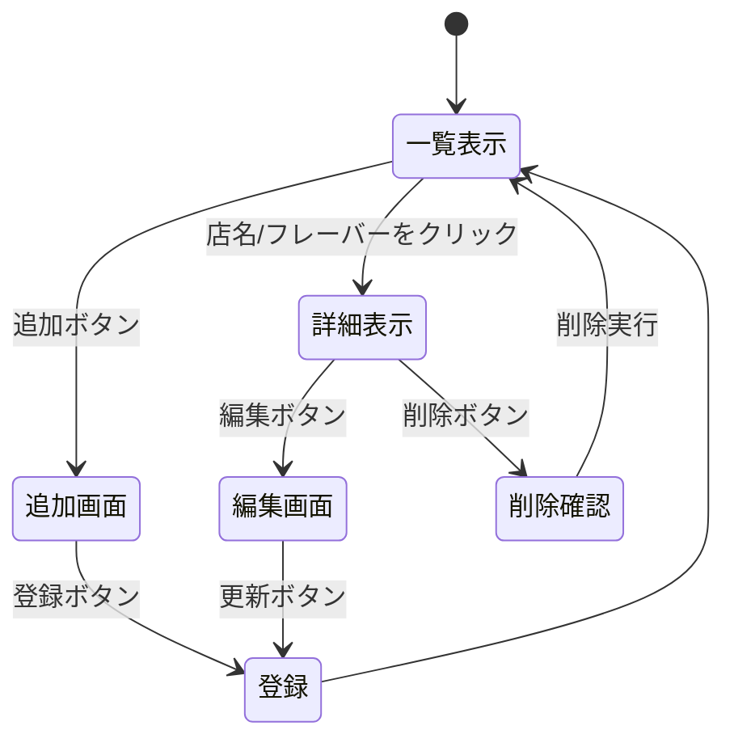

# 開発者向け仕様書（仮）  
カヌレショップ紹介・評価システム

## 1. システム概要

本システムは，「カヌレショップ紹介・評価システム」である。  
ユーザは，自分が訪れたカヌレの試食記録を登録し，  
「店名」「フレーバー」「スコア」を一覧で確認できる。

各項目をクリックすることで詳細情報（価格，外側のカリカリ度，内側のやわらかさ，甘さ，コメントなど）を表示できる。  
さらに，記録の追加・編集・削除が可能であり，  
REST API による統一した操作（一覧・詳細・追加・削除・更新）を提供する。

本システムでは，  
**「1レコード = 特定のカヌレショップ＋特定フレーバーの試食記録」**  
として扱う。  
同じ店舗でも違うフレーバーなら別レコードとして登録する。


## 2. データ構造

カヌレ試食記録は，以下のようなオブジェクト配列として保持する。

```javascript
let caneles = [
  {
    id: 1,
    shop: "Canele de Chianti",
    area: "六本木",
    price: 375,
    flavor: "プレーン",
    crunch: 2,
    softness: 5,
    sweetness: "甘い",
    notes: "ラムのような後味、卵感強め",
    score: 5,
    comment: "生地感が強く、外側は硬さはあるがカリッとしない。つやは完璧。"
  },
  {
    id: 2,
    shop: "Canele de Chianti",
    area: "六本木",
    price: 375,
    flavor: "塩キャラメル",
    crunch: 2,
    softness: 4,
    sweetness: "とても甘い",
    notes: "焦がしキャラメル、海塩、焦がし砂糖の後味",
    score: 5,
    comment: "柔らかくパンのような食感。つやは美しいが全体的に柔らかい。"
  },
];
```

プロパティの意味：

- **id** : レコードの一意の識別子（自動採番）  
- **name** : 店名  
- **location** : 場所  
- **price** : 価格（円）  
- **flavor** : フレーバー名  
- **outerCrunch** : 外側のカリカリ度（1〜10）  
- **innerSoftness** : 内側のやわらかさ（1〜10）  
- **sweetness** : 甘さの傾向（文字列）  
- **flavorNotes** : 風味メモ  
- **score** : 総合評価  
- **comments** : コメント・食後の印象  


## 3. REST API 仕様

### 3.1 一覧表示（GET）

```
GET /caneles
```

全レコードを読み込み，  
**店名・フレーバー・スコアの3項目のみ**を一覧に表示する。  


### 3.2 詳細表示（GET）

```
GET /caneles/:id
```

指定した `id` の記録の詳細情報を表示する。

---

### 3.3 追加画面表示（GET）

```
GET /caneles/new
```

新規登録フォームを表示する。

---

### 3.4 新規追加処理（POST）

```
POST /caneles
```

フォーム内容を受け取り，新しいレコードを `caneles` 配列に追加する。  
`id` は「現在の最大ID + 1」で自動採番する。

---

### 3.5 編集画面表示（GET）

```
GET /caneles/:id/edit
```

指定した `id` のデータをフォームに表示し，編集できるようにする。

---

### 3.6 更新処理（POST）

```
POST /caneles/:id/update
```

編集内容で該当レコードを上書き保存する。

---

### 3.7 削除処理（POST）

```
POST /caneles/:id/delete
```

対象レコードを `caneles` 配列から削除し一覧に戻る。


## 4. ページ構造

- `/caneles` — 一覧ページ（店名＋フレーバー＋スコア）  
- `/caneles/:id` — 詳細ページ（全項目表示）  
- `/caneles/new` — 新規追加フォーム  
- `/caneles/:id/edit` — 編集フォーム  


## 5. ページ遷移図（Mermaid）



一覧ページでは情報を絞るため，  
**店名・フレーバー・スコアのみ**を表示する。  
その他の詳細項目は詳細ページで表示する。


## 6. 機能の詳細

### 6.1 一覧機能

- `caneles` 配列から全レコードを読み込む。  
- 一覧には **店名・フレーバー・スコアの3項目のみ**を表示する。  
- 行をクリックすると詳細ページへ遷移する。  
- 同一店舗でも別フレーバーは別レコードとして表示される。  


### 6.2 詳細機能

- 指定IDのデータを全項目表示する。  
- 「編集」「削除」「一覧へ戻る」ボタンを配置する。  


### 6.3 新規追加機能

- `/caneles/new` にてフォーム入力を受け付ける。  
- POST後，新しい `id` を採番して `caneles.push()` する。  


### 6.4 更新機能

- `/caneles/:id/edit` で既存データをフォームに表示する。  
- 更新後は詳細ページまたは一覧ページへ戻る。  


### 6.5 削除機能

- 削除確認画面を出し，実行後 `caneles` 配列から該当レコードを削除する。  


## 7. 使用技術

- Node.js / Express  
- EJS  
- HTML / CSS  

本授業の方針により React などのフレームワークは使用しない。  
データはファイル保存せず，変数内の配列で管理する。


## 8. 今後の拡張案（任意）

- カヌレ写真の追加  
- フレーバー・甘さ・カリカリ度などのフィルタ機能  
- スコア順ソート  
- JSON によるデータ永続化  
